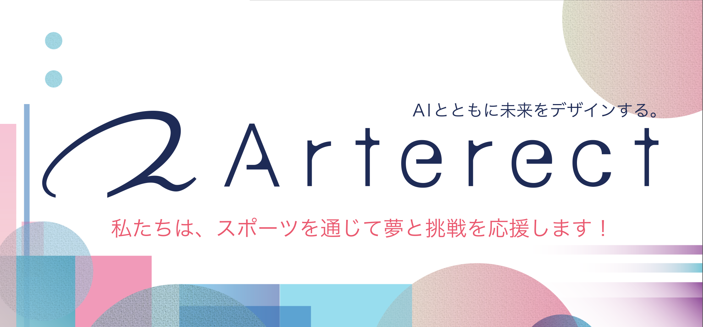

<table width="100%">
<tr>
<td width="70%" valign="top">

<h1><b>HAYATE ESAKI</b></h1>
<h3>AI Engineer & Visionary | Building the Future of Decentralized Intelligence</h3>

 

I'm an AI engineer and researcher passionate about the intersection of **AI, space exploration, quantum computing, and blockchain**. My work focuses on developing next-generation technologies that will shape the AGI era.

 

    
    
    
    
    

</td>
<td width="30%" valign="top">

</td>
</tr>
</table>

 

  

## 📝 Latest Articles

<!-- ZENN-POSTS:START -->
<!-- ZENN-POSTS:END -->

## 🚀 My Vision & Projects

My work is centered around two core pillars: **PoAI**, a next-generation consensus mechanism, and **Enify**, a multi-agent AI platform.

<table width="100%">
  <tr>
    <td width="50%" valign="top">
      
    </td>
    <td width="50%" valign="top">
      
    </td>
  </tr>
</table>

## 🏢 My Organization

I am a core member of the **[Arterect Community](https://www.arterect.net/)**, a research collective dedicated to pioneering the future of AGI and decentralized systems. Together, we are building the future of intelligence.

## 🛠️ Tech Stack

<h4>Languages</h4>

  

<h4>AI/ML & Data Science</h4>

  

<h4>Web & Backend</h4>

  

<h4>Infrastructure & DevOps</h4>

  

<h4>Blockchain</h4>

  

## 📊 My GitHub Activity

  

    

  

---

  <i>I'm always open to collaborating on innovative projects and discussing new ideas.</i>

